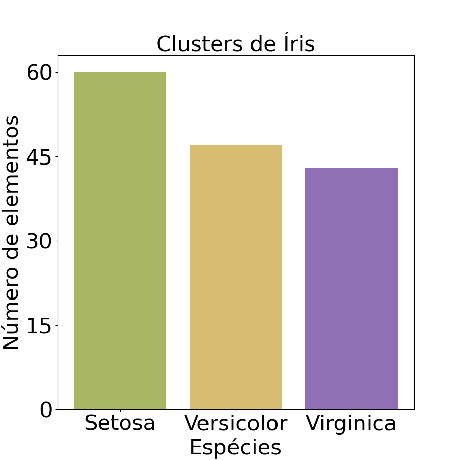
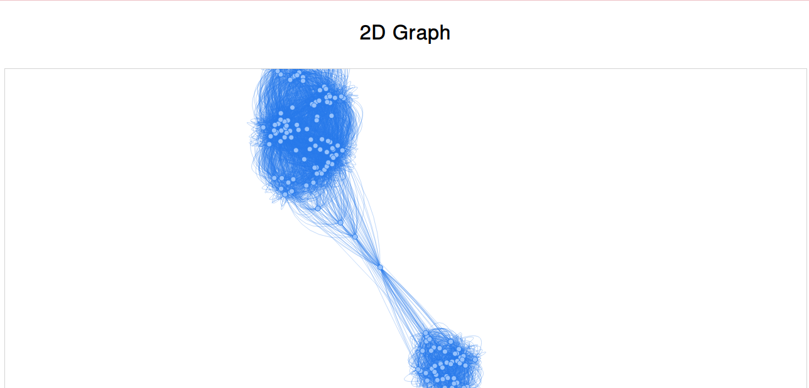

# Teoria dos Grafos (TEG)

## Trabalho de TEG

---

**Alunos:** André Felipe Fuck e Kauan Henrique Werlich

---

## Tarefa 1.B

### Estrutura do Software:

O software foi dividido em 5 arquivos, dos quais todas estão dentro da pasta **src**. Estes são:

+ Flores: faz a leitura do arquivo csv do Íris dataset. Passando os dados para uma struct flores.

+ Grafo: faz a leitura e escrita em um arquivo csv, ou txt, da struct Grafo. Essa struct tem como objetivo fazer uma representação intermediária     entre a struct Flores e a Matriz de Adjacência.

+ Matriz: faz o processo de transformar os dados obtidos por Flores em um Grafo. Isso ocorre por meio do processo de normalização da distâncias euclidiana.

+ Matriz de Adjacências: é a representação computacional de um grafo e de suas adjacências. Permitindo fazer uma busca por profundidade no grafo.

+ Matriz de Confusão: contém duas estruturas principais, Clusters e Matriz de Confusão. Contendo as funções que fazem o processo de separação do grafo em clusters que representam cada espécie de Íris. Junto a isso a matriz de confusão permite calcular a acurácia.

## Comando para rodar o programa:

O programa possui um arquivo Makefile que facilita na de compilação dos arquivos. Para compilar o arquivo basta dar o comando:

```
make
```

Para rodar o programa:

```
make run
```

Caso queira rodar o programa sem usar Makefile:

```
gcc main.c src/grafo.c src/flores.c src/matriz.c src/matriz_adjacencias.c src/matriz_confusao.c -o main -lm
```

## Treinamento:

A primeira parte do treinamento foi encontrar uma medida que permitesse criar um grafo com conjuntos dijuntos entre estes. Para isso era necessário encontrar uma metrica que fosse menor que 0.3 e, que tivesse no minimo tres grupos com um numero siginificativo de elementos. Criamos uma função chamada **log_clusters**, presente no arquivo matriz de confusão, que guardava em arquivo texto vários clusters usando metricas diferentes.A partir disso encontramos a metrica 0.057, que gerava 3 clusters com um número elevado de elementos.

Cada cluster contém o número de elementos, um array com os índices dos vértices, uma struct Flor para calcular o centro geométrico do cluster e a espécie que representa a maioria dos vértices.

Contudo não foi possível achar uma métrica que gerasse apenas três clusters. Então foi necessário englobar os clusters menores nos maiores, foram englobados os clusters que tivessem a menor distância euclidiana de um cluster grande.

## Avalição

A partir desse treinamento foi possível separar o grafo em três clusters, o histograma abaixo representa a relação entre o número de elementos de cada cluster e a sua especie.



Para avaliar os resultados do Clustering, utilizamos uma matriz de confusão para calcular a acurácia de nosso modelo. A tabela abaixo mostra a matriz de confusão.

|   |    Setosa|  Versicolor |   Virginica|
|---|---|---|---|
|  Setosa |  50 |  4 |  6 |
|  Versicolor |  0 |  40 |  3 |
|  Virginica |  0 |  6 |   41|

A partir disso foi possível calcular a acurácia de cada espécie.

|Especie |Acuracia   |
|---|---|
| Setosa |  0.933 |
| Versicolor  | 0.913  |
| Virginica |   0.9|

## Representação gráfica:

Na implementação gráfica usamos o script em python feito pelo monitor da disciplina. Usamos o programa que estava no diretório do Github do monitor.

Infelizmente não conseguimos rodar o grafo em 3D. Então geramos uma versão 2D. Segue a baixo a imagem do grafo:


